# 目錄
1. [應用](#應用)
2. [使用 Faster R-CNN 進行物件偵測 - 訓練資料以 Table 格式](#使用-faster-rcnn-進行物件偵測---訓練資料以-table-格式)
   1. [建立新檔案 (.m)](#建立新檔案-m)
   2. [下載數據集](#下載數據集)
   3. [讀取圖像並顯示物件框](#讀取圖像並顯示物件框)
   4. [分割訓練集與測試集](#分割訓練集與測試集)
   5. [設定訓練選項](#設定訓練選項)
   6. [繼續訓練 Faster R-CNN](#繼續訓練-faster-rcnn)
   7. [測試模型](#測試模型)
   8. [測試集的測試結果，並評估](#測試集的測試結果並評估)
3. [使用 Faster R-CNN 進行物件偵測 - 訓練資料以 Datastore 物件](#使用-faster-rcnn-進行物件偵測---訓練資料以-datastore-物件)
   1. [優點](#優點)
   2. [前置作業](#前置作業)
   3. [載入資料集](#載入資料集)
   4. [分割數據集](#分割數據集)
   5. [建立物件偵測需要的 Datastore](#建立物件偵測需要的-datastore)
   6. [建立 Faster R-CNN 物件偵測網路](#建立-faster-rcnn-物件偵測網路)
   7. [資料擴增](#資料擴增)
   8. [設置訓練選項](#設置訓練選項)
   9. [訓練 Faster R-CNN](#訓練-faster-rcnn)
   10. [測試模型](#測試模型)
   11. [測試結果及評估](#測試結果及評估)

# :star:應用
標記出你要的物件，然後判斷類別
# 💡使用Faster R-CNN 進行物件針測-訓練資料以Table格式
## ✏️建立新檔案(.m)
命名成FasterRCNNDemo.m，存入新資料夾中
## 下載數據集
下載訓練集(295張圖像車輛數據集)，每個圖像都包含1or2個標記車輛，適合訓練Faster R-CNN，透過以下指令則能下載，
下載後可以在WorkSpace看到。
```python=
unzip vehicleDatasetImages.zip
data = load ('vehicleDatasetGroundTruth.mat');
vehicleDataset = data.vehicleDataset;
vehicleDataset
```
載入的數據集型態為Table格式，第一行為圖像路徑，第二行為物件框的長寬與位置

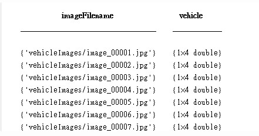

## 讀取圖像並顯示物件框
隨機顯示一張圖片及其物件框，其中table的呼叫方式類似於物件導向
💡舉例，如果要得到第一張的圖像路徑，就需要打vehicleDataset.imageFilename{1}
```python=
idx = randperm(295,1);
I = imread (vehicleDataset.imageFilename{idx}); %圖像路徑
bbox = vehicleDataset.vehicle{idx}; %對應圖像框
annotatedImage = insertShape(I,'Rectangle',bbox);
annotatedImage = imresize(annotatedImage,2);
figure
imshow(annotatedImage)
```

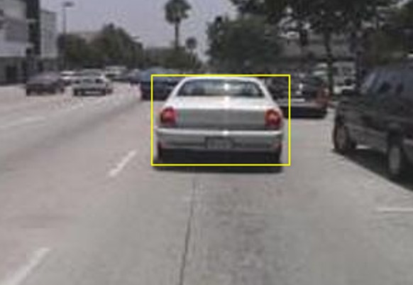

## 分割訓練集與測試集
每一次訓練都要將資料集分成訓練集與測試集，這邊拆成70%訓練集與30%測試集
```python=
rng(0)
shuffledIndices = randperm(height(vehicleDataset));
idx = floor(0.7*height(vehicleDataset));

trainingIdx = 1:idx;
trainingDataTb1 = vehicleDataset(shuffledIndices(trainingIdx),:);

validationIdx = idx + 1: idx + 1 + floor(0.1*length(shuffledIndices));
validationDataTbl = vehicleDataset(shuffledIndices(validationIdx),:);

testIdx = validationIdx(end)+1:length(shuffledIndices);
testDataTb1 = vehicleDataset(shuffledIndices(testIdx),:);
```

## 設定訓練選項(開始訓練瞜~)
checkingpoitpath 可由pwd得知
**GPU**
```python=
options = trainingOptions('sgdm', ...
    'MaxEpochs', 10, ...
    'MiniBatchSize', 1, ...
    'InitialLearnRate', 1e-3, ...
    'CheckpointPath', tempdir);
```
**CPU(這台電腦沒有GPU)**
```python=
options = trainingOptions('sgdm', ...
    'MaxEpochs', 10, ...
    'MiniBatchSize', 1, ...
    'InitialLearnRate', 1e-3, ...
    'CheckpointPath', tempdir, ...
    'ExecutionEnvironment', 'cpu');  % 強制使用 CPU 訓練
```
## 繼續訓練Faster R-CNN
如果選true則再次訓練，如果選false則去下載人家訓練好的模型
```python=
% doTrainingAndEval = true; % 用自己的，建議要有gpu不然根本跑不動
doTrainingAndEval = false; % 用人家訓練好的
if doTrainingAndEval
    % 使用 ResNet-18 作為基本網絡
    net = 'resnet18';
    
    % 訓練 Faster R-CNN 目標檢測器
    [detector, info] = trainFasterRCNNObjectDetector(trainingDataTb1, net, options, ...
        'NegativeOverlapRange', [0 0.3], ...
        'PositiveOverlapRange', [0.6, 1]);
    
else
    % 載入預訓練的檢測器
    disp('Downloading pretrained detector (118 MB)...');
    
    % 下載預訓練模型
    pretrainedURL = 'https://www.mathworks.com/supportfiles/vision/data/fasterRCNNResNet50EndToEndVehicleExample.mat';
    websave('fasterRCNNResNet50EndToEndVehicleExample.mat', pretrainedURL);
    
    % 載入下載的模型
    pretrained = load('fasterRCNNResNet50EndToEndVehicleExample.mat');
    
    % 使用預訓練的檢測器
    detector = pretrained.detector;
end
```
## 使用測試集去測試訓練好的模型(Faster R-CNN)
選取8張圖片來測試，並使用detect函示來預測選取圖鑑的物件框，其中bbox及scores分別代表預測物件與信心分數，然後使用insertObjectAnnotation整理好，之後好以figure形式呈現。
```python=
I = imread (testDataTb1.imageFilename{8}); %選取8張圖片來測試
[bboxes, scores] = detect (detector, I);

I = insertObjectAnnotation(I,'rectangle',bboxes,scores);
figure
imshow(I)
```
**呈現**

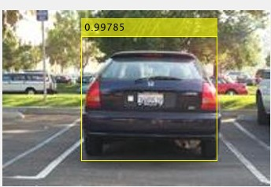

## 測試集的測試結果，並評估
AP(Average precision)為物件偵測的評估指標，為precision-recall曲線下的面積。AP最高為1，當AP愈高表示模型性能愈好。
想要計算AP需要將測試集的結果皆收集起來，才能夠計算precision與recall。所以定義3個細胞陣列(bboxes, scores, labels)來儲存boxe, score, label這3個結果。最後將3筆數據轉成table，並去做AP的分析。
```python=
bboxes = cell(height(testDataTb1),1);
scores = cell(height(testDataTb1),1);
labels = cell(height(testDataTb1),1);
for i =1:height(testDataTb1)
    I = imread(testDataTb1.imageFilename{i});
    [bbox, score, label]=detect(detector,I);
    bboxes{i,1} = bbox;
    scores{i,1}=score;
    labels{i,1}=label;
end
% 將3筆數據轉成table，並去做AP的分析
detectionResults = table (bboxes, scores, labels);
```
**結果**
* bboxes : 每張圖片的預測物件框，格式m*4 double ， m為預測數量
* scores : 預測物件框的信心分數，有m個物件框，就有m個分數
* labels : 預測物件的標籤名稱

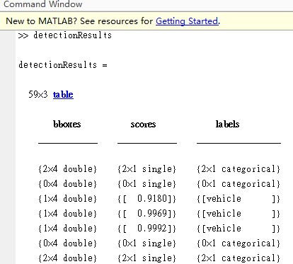

## 計算物件偵測的平均準確度
最後去驗證我們模型的平均準確度。
這裡使用evaluateDetectionPrecision函示來算AP，detectionResults是預測結果，
第一行:bboxes，第二行:信心分數:testDataTb1是真實的測試集物件位置。最後能得到AP, recall,及precision。
```python=
[ap, recall, precision] = evaluateDetectionPrecision(detectionResults(:,1:2),testDataTb1(:,2));
figure
plot(recall,precision)
grid on
title(sprintf('Average Precision = %.1f',ap))
```
**結果**

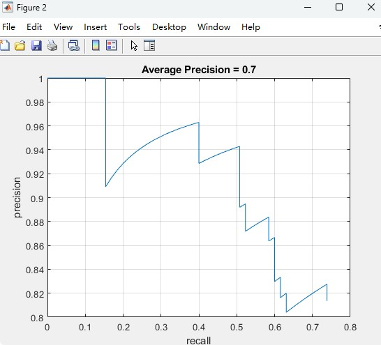

AP只有0.7結果不太好~
原因
1. 訓練集不夠
2. 圖片解析度不夠高

# 💡使用Faster R-CNN 進行物件針測-訓練資料以Datastore物件
**優點**
* 可以進行資料擴增
* 訓練過程中，能應用早停技術

**麻煩點** 
需要自行設計一Faster R-CNN

以下會將RestNet-18改成一Faster R-CNN此外也會應用資料擴增。
## ✏️前置作業
創建一新資料夾，存放以下函示，之後主程式會用到
名稱:augmentData.m
```python =
function data = augmentData(data)
% randonly flip images and bounding boxes horizontally
tform = randomAffine2d('XReflection',true);
rout = affineOutputView(size(data{1}),tform);
data{1} = imwarp(data{1},tform,'OutputView',rout);
data{2} = bboxwarp(data{2},tform,rout);
end
```
名稱:preprocessData.m
```python =
function data = preprocessData(data, targetSize)
% Resize image and bounding boxes to targetSize
scale = targetSize(1:2)./size(data{1},[1,2]);
data{1} = imresize(data{1},targetSize(1:2));
data{2} = bboxresize(data{2},scale);
end
```
## 載入資料
```python =
%% 下載資料
unzip vehicleDatasetImages.zip
data = load ('vehicleDatasetGroundTruth.mat');
vehicleDataset = data.vehicleDataset;
```
## 分割數據集
```python =
%% 分割數據集
rng(0)
shuffledIndices = randperm(height(vehicleDataset));
idx = floor(0.7*height(vehicleDataset));

trainingIdx = 1:idx;
trainingDataTb1 = vehicleDataset(shuffledIndices(trainingIdx),:);

validationIdx = idx + 1: idx + 1 + floor(0.1*length(shuffledIndices));
validationDataTb1 = vehicleDataset(shuffledIndices(validationIdx),:);

testIdx = validationIdx(end)+1:length(shuffledIndices);
testDataTb1 = vehicleDataset(shuffledIndices(testIdx),:);
```
## 建立物件偵測需要的Datastore
分別建立訓練驗證及測試資料的imageDatastorer及boxLabelDatastore，並使用combine函示將其組合成一個Datastore，透過read讀取Datastore一張圖像，並使用annotatedImage顯示圖片及框框。
```python =
%% 建立物件專用的Datastore
imdsTrain = imageDatastore (trainingDataTb1{:,'imageFilename'});
bldsTrain = boxLabelDatastore(trainingDataTb1(:,'vehicle'));

imdsValidation = imageDatastore (validationDataTb1{:,'imageFilename'});
bldsValidation = boxLabelDatastore(validationDataTb1(:,'vehicle'));

imdsTest = imageDatastore (testDataTb1{:,'imageFilename'});
bldsTest = boxLabelDatastore(testDataTb1(:,'vehicle'));

trainingData = combine(imdsTrain,bldsTrain);
validationData = combine(imdsValidation,bldsValidation);
testData = combine(imdsTest,bldsTest);

data = read(trainingData);
I = data{1};
bbox = data {2};
annotatedImage = insertShape(I,'Rectangle',bbox);
annotatedImage = imresize(annotatedImage,2);
figure
imshow(annotatedImage)
```
## 建立Faster R-CNN 物件偵測網路
Faster R-CNN可以被簡單的建立，只需要輸入幾個參數~輸入參數分別是
* 圖像大小
* 類別數
* AnchorBoxes
* 使用什麼的卷積網路?
* 選定特徵提取層

以下是以ResNet-18為主體，將其修改為Faster R-CNN加以利用，並且圖片大小為224 * 224 * 3，使用estimateAnchorBoxes獲得合適的AnchorBoxes。
```python =
%% 建立 Faster R-CNN 網路
numClasses = width (vehicleDataset)-1;
featureExtractionNetwork = resnet18;
inputSize = featureExtractionNetwork.Layers(1).InputSize;
featureLayer = 'res4b_relu';
preprocessedTrainingData = transform(trainingData,@(data)preprocessData(data,inputSize));
numAnchors = 3;
anchorBoxes = estimateAnchorBoxes(preprocessedTrainingData, numAnchors)
lgraph = fasterRCNNLayers(inputSize,numClasses,anchorBoxes,featureExtractionNetwork,featureLayer);
analyzeNetwork(lgraph)
```
## 資料擴增
使用transform對訓練的資料進行擴增，且transform函示可以對整個Datastore皆進行處理，此例是進行水平鏡射
```python =
augmentedTrainingData = transform (trainingData,@augmentData);
```
## 準備訓練所需資料
之前有提到所有圖像皆是224 * 224 * 3，所以透過以下方式調整圖片大小
```python =
trainingData = transform(augmentedTrainingData,@(data)preprocessData(data,inputSize));
validationData = transform (validationData,@(data)preprocessData(data,inputSize));
```
## 設置訓練選項
* 優化器 : sgdm
* 最大訓練次數 : 10
* 最小批次大小(i.e. 最小驗證次數) : 2
* 初始學習速率 : 0.001
* 檢查點路徑
* 添加驗證資料
因為這次圖像大小一致，所以不用使用GPU
```python =
%% 設置訓練選項
options = trainingOptions('sgdm', ...
    'MaxEpochs', 10, ...
    'MiniBatchSize', 2, ...
    'InitialLearnRate', 1e-3, ...
    'CheckpointPath', tempdir, ...
    'ValidationData',validationData);
```
## 訓練 Faster R-CNN
如果是true則使用trainFasterRCNNObjectDetector訓練Faster R-CNN~否則載入之前訓練好的網路。
```python =
%% RUN 模型瞜~
doTrainingAndEval = true; % 用自己的，建議要有gpu不然根本跑不動
% doTrainingAndEval = false; % 用人家訓練好的
if doTrainingAndEval
    % 訓練 Faster R-CNN 目標檢測器
    [detector, info] = trainFasterRCNNObjectDetector(trainingData, lgraph, options, ...
        'NegativeOverlapRange', [0 0.3], ...
        'PositiveOverlapRange', [0.6, 1]);
    
else
    
    % 下載預訓練模型
    pretrained = load('fasterRCNNResNet50EndToEndVehicleExample.mat');
    detector = pretrained.detector;
    
end
```
**True**

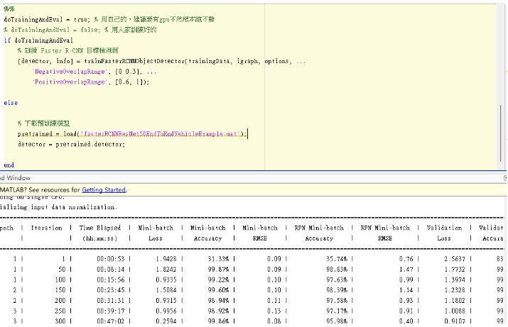

上述跑 2 h
## 評估網路
最後使用detect指令對datastore進行測試，與table格式差異在於不用再讀取資料後整理成圖，能直接讀圖去判定。
**不用做以下**

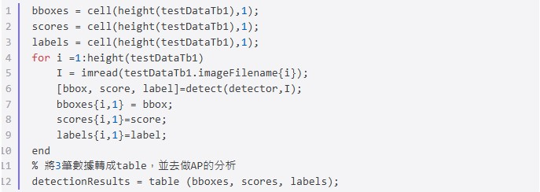

**程式**
```python =
%% 評估網路
testData = transform(testData,@(data)preprocessData(data,inputSize));
if doTrainingAndEval
    detectionResults = detect(detector,testData,'MinibatchSize',4);
else
    % load pretrained detector for example.
    pretrained = load ('fasterRCNNResNet50EndToEndVehicleExample.mat');
    detectionResults = pretrained.detectionResults;
end
[ap, recall,precision] = evaluateDetectionPrecision(detectionResults, testData);

figure
plot(recall, precision)
xlabel('Recall')
ylabel('Precision')
grid on
title(sprintf('Average Precision = %2f',ap))
```

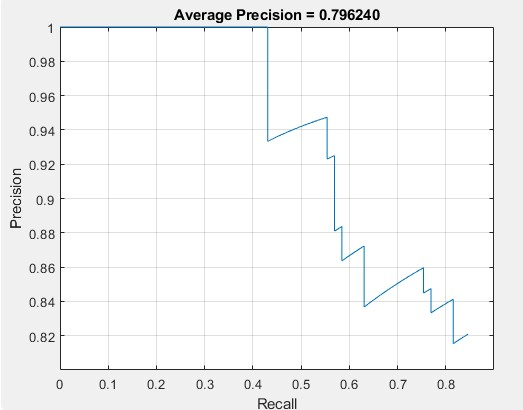


# 測試程式
## 顯示信心值
圖片選擇224*224像素

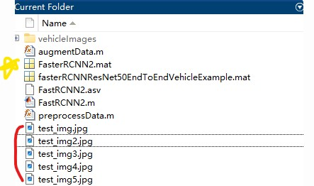

```python =
%% 顯示scores
% 1. 載入預訓練的 Faster R-CNN 模型
%pretrained = load('fasterRCNNResNet50EndToEndVehicleExample.mat');
pretrained = load('FasterRCNN2.mat');
detector = pretrained.detector;

% 2. 讀取要檢測的圖片
I = imread('test_img4.jpg');  % 請更換為你的圖片路徑

% 3. 使用 Faster R-CNN 檢測物體
%[bboxes, scores, labels] = detect(detector, I);
[bboxes, scores] = detect (detector, I);
I = insertObjectAnnotation(I,'rectangle',bboxes,scores);
figure
imshow(I)
```
:star:成果

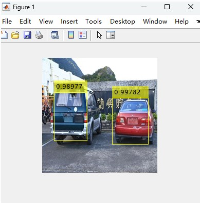

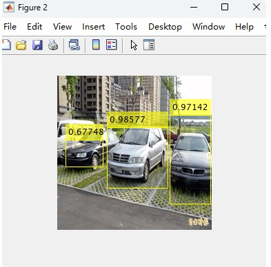

車子太小效果差

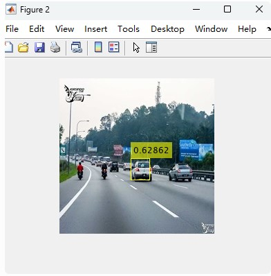

## 顯示標籤
圖片選擇224*224像素
```python =
%% 顯示labels
% 1. 載入預訓練的 Faster R-CNN 模型
% pretrained = load('fasterRCNNResNet50EndToEndVehicleExample.mat');
pretrained = load('FasterRCNN2.mat');
detector = pretrained.detector;

% 2. 讀取要檢測的圖片
I = imread('test_img.jpg');  % 請更換為你的圖片路徑

% 3. 使用 Faster R-CNN 檢測物體
[bboxes, scores, labels] = detect(detector, I);
%[bboxes, scores] = detect (detector, I);
I = insertObjectAnnotation(I,'rectangle',bboxes,labels);
figure
imshow(I)
```
:star:成果

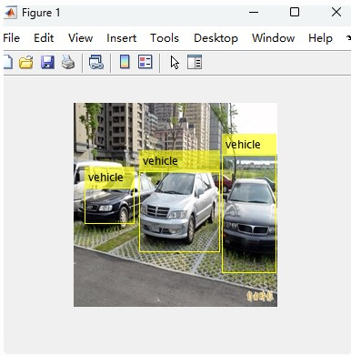

🎉恭喜你訓練完了🎉:smile:
